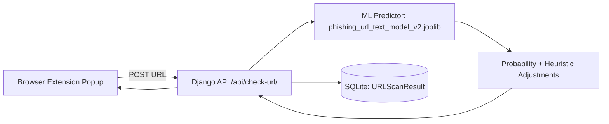

<h1 align="center">PhishGuard AI</h1>
<p align="center">
  Browser-first phishing detection powered by a Django API and ML risk scoring engine.
</p>

<p align="center">
  
  
  
  
</p>

---

## Why This Project Exists
Phishing attempts move fast and look increasingly legitimate. PhishGuard AI is designed to give a quick, human-friendly verdict for any active URL by combining:

- A browser extension UX for one-click scanning
- A Django REST API for URL analysis
- A machine learning model plus rule-based safety adjustments
- Persistent scan logging for audit and review

## Highlights
- Real-time URL risk check from extension popup
- API endpoint: `POST /api/check-url/`
- Structured verdicts: `safe`, `suspicious`, `phishing`
- Risk tiers: `low`, `medium`, `high`
- Probability outputs and explainable reasons
- SQLite-backed scan history in `URLScanResult`

## Table of Contents
- [Quick Start](#quick-start)
- [API Contract](#api-contract)
- [Decision Logic Snapshot](#decision-logic-snapshot)
- [Training Workspace](#training-workspace)
- [Production Hardening Checklist](#production-hardening-checklist)
- [Troubleshooting](#troubleshooting)

## System Architecture


## Project Structure
```text
phishguard-ai/
├── browser_extension/
│   ├── manifest.json
│   ├── popup.html
│   ├── popup.js
│   ├── style.css
│   └── icons/
├── phishing_backend/
│   ├── manage.py
│   ├── db.sqlite3
│   ├── phishing_backend/
│   └── scanner/
│       ├── views.py
│       ├── models.py
│       ├── urls.py
│       └── ml/
│           ├── predictor.py
│           └── phishing_url_text_model_v2.joblib
└── phishing_model/
    ├── train_*.py
    ├── dataset/
    ├── models/
    └── scripts/
```

## Quick Start
### 1) Clone and Install
```bash
git clone <your-repo-url>
cd phishguard-ai
python3 -m venv .venv
source .venv/bin/activate
pip install -r requirements.txt
```

### 2) Start the Backend
```bash
cd phishing_backend
python manage.py migrate
python manage.py runserver
```

Backend URL:
- `http://127.0.0.1:8000`

API route used by extension:
- `http://127.0.0.1:8000/api/check-url/`

### 3) Verify API from Terminal
```bash
curl -X POST http://127.0.0.1:8000/api/check-url/ \
  -H "Content-Type: application/json" \
  -d '{"url":"https://github.com"}'
```

### 4) Load the Browser Extension
1. Open `chrome://extensions/`
2. Enable **Developer mode**
3. Click **Load unpacked**
4. Select the `browser_extension/` folder
5. Pin **PhishGuard AI** and test on any open tab

### 5) Optional Environment Configuration
The project currently runs with defaults in Django settings. For GitHub/public deployments, use environment variables:

```bash
cp .env.example .env
```

Suggested `.env` values:

```env
DJANGO_SECRET_KEY=replace-with-a-strong-secret
DJANGO_DEBUG=False
DJANGO_ALLOWED_HOSTS=127.0.0.1,localhost
```

Then update settings to read these values before production release.

## API Contract
### Request
```http
POST /api/check-url/
Content-Type: application/json

{
  "url": "http://verify-account-example.com/login"
}
```

### Success Response
```json
{
  "success": true,
  "result": {
    "input_url": "http://verify-account-example.com/login",
    "clean_url": "http://verify-account-example.com/login",
    "domain": "verify-account-example.com",
    "verdict": "suspicious",
    "risk_level": "medium",
    "raw_phishing_probability": 58.2,
    "phishing_probability": 68.2,
    "legitimate_probability": 31.8,
    "reasons": [
      "URL does not use HTTPS.",
      "Sensitive keyword found in URL."
    ]
  }
}
```

### Error Response
```json
{
  "success": false,
  "message": "URL is required."
}
```

## Decision Logic Snapshot
The predictor returns model probability, then adjusts risk based on practical phishing cues:

- Trusted domains reduce risk cap
- Non-HTTPS URLs increase risk
- Sensitive keywords (login, verify, password, bank, otp, etc.) increase risk
- Final probabilities are clamped to 0-100

This hybrid approach improves real-world usability compared to model-only outputs.

## Training Workspace
Model experimentation and retraining scripts live in `phishing_model/`:

- `train_url_text_model_v2.py` (primary text+URL model path)
- `train_random_forest.py`
- `train_simple_url_model.py`
- Evaluation/prediction helpers under `scripts/`

## Production Hardening Checklist
Before deploying publicly:

- Move `SECRET_KEY` to environment variables
- Set `DEBUG = False`
- Restrict `ALLOWED_HOSTS`
- Tighten CORS policy (avoid allow-all in production)
- Add authentication/rate limiting for API
- Add monitoring and scan anomaly alerts
- Add automated tests for API and model behavior

## Troubleshooting
- `Extension shows fetch/network error`: make sure Django is running on `127.0.0.1:8000`.
- `Model loading error`: verify `phishing_backend/scanner/ml/phishing_url_text_model_v2.joblib` exists.
- `CORS/browser blocking`: keep `django-cors-headers` installed and confirm middleware is enabled.
- `Module not found`: activate the project virtual environment and reinstall with `pip install -r requirements.txt`.

## Roadmap
- Batch scan mode for domain lists
- Browser-side caching of recent verdicts
- Threat intel feed enrichment
- Confidence calibration dashboard
- CI pipeline for model validation + API tests

## License
MIT is a common default

---

<p align="center">
  Built for practical phishing defense: fast verdicts, explainable reasons, and extensible ML workflows.
</p>
