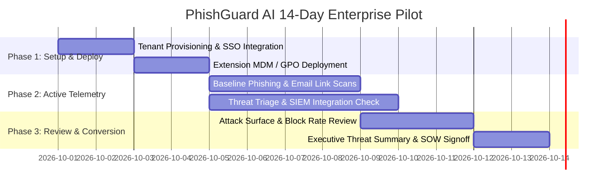

# PhishGuard AI - Enterprise Pilot Onboarding Playbook

A structured 14-day guide for onboarding Indian BFSI institutions, Fintechs, NBFCs, and Enterprise SOC teams onto the PhishGuard AI commercial platform.

---

## 1. Pilot Program Overview

- **Duration:** 14 Calendar Days (Extendable by 7 days upon Mutual Agreement)
- **Target Audience:** CISOs, Security Operations (SOC) Leads, IT Administrators, Risk & Compliance Officers
- **Scope:** Up to 250 Endpoints / Mailboxes across Corporate and Remote Workforces
- **Cost:** Zero-cost evaluation with complete enterprise feature access (SSO, SIEM streaming, Audit logs, BFSI Lookalike engine)

---

## 2. 14-Day Pilot Timeline & Milestones



### Day 1–2: Provisioning & Identity Federation
- **Objective:** Establish enterprise tenant and configure identity provider.
- **Action Items:**
  1. Provision Enterprise Organization tenant on `https://app.phishguard.ai`.
  2. Configure SAML 2.0 / OIDC SSO with Okta, Azure AD / Microsoft Entra ID, or Google Workspace.
  3. Validate JIT (Just-In-Time) user provisioning and role-based access control (Admin, SOC Analyst, Member).
  4. Generate and distribute initial API keys for SIEM and custom integrations.

### Day 3–4: Fleet Rollout via MDM / GPO
- **Objective:** Deploy PhishGuard MV3 browser extension across designated pilot user endpoints.
- **Rollout Channels:**
  - **Google Workspace / Chrome Enterprise Management:** Force-install Extension ID via Google Admin Console policy.
  - **Microsoft Intune / Group Policy Object (GPO):** Configure Windows Registry `ExtensionInstallForcelist`.
  - **Configuration JSON:** Pre-configure Enterprise Organization API Key and Tenant Domain in managed storage policies.

### Day 5–9: Active Telemetry & Inbox Link Scanning
- **Objective:** Monitor live threats, inbox spoofing detection, and credential theft attempts.
- **Action Items:**
  1. Enable in-inbox scanning for corporate Gmail / Outlook Web users.
  2. Connect live threat stream to corporate SIEM (Splunk HEC, Microsoft Sentinel, or Datadog).
  3. SOC Analysts review the real-time Triage Queue in the PhishGuard Team Dashboard.
  4. Validate custom Org Whitelist / Blacklist policies for internal intranet domains.

### Day 10–12: Executive Metrics & Risk Impact Assessment
- **Objective:** Quantify prevented credential harvesting attempts and zero-day phishing exposure.
- **KPI Review:**
  - Total URLs scanned vs. high-risk malicious domains blocked.
  - BFSI typosquatting detections (e.g., fraudulent banking, tax, and UPI replicas intercepted).
  - Webmail sender-domain spoofing anomalies detected.
  - Mean Time to Intercept (sub-100ms client pre-navigation verdict).

### Day 13–14: Commercial Proposal & Production Transition
- **Objective:** Finalize SOC sign-off, Data Processing Agreement (DPA), and transition to annual subscription.
- **Deliverables:**
  1. Executive Pilot Threat Report (PDF / Dashboard Export).
  2. Executed Data Processing Agreement (India DPDP Act / GDPR aligned).
  3. Commercial SOW / GST Invoice activation for annual Team or Enterprise license.

---

## 3. Outreach & Email Templates for Indian BFSI & Fintech

### Template A: Initial CISO Outreach (BFSI / Fintech)

**Subject:** Zero-Day BFSI Phishing Defense & Employee Inbox Protection | PhishGuard AI

```text
Hi [First Name],

Over the past quarter, Indian financial institutions have seen a sharp surge in sophisticated lookalike domains, homograph typosquats, and weaponized inbox links targeting employee credentials and OTP portals.

PhishGuard AI provides a sub-100ms, zero-PII real-time defense layer that intercepts malicious navigation and flags spoofed email links directly inside Gmail and Outlook Web before credentials can be harvested.

Key capabilities trusted by security teams:
• Instant detection of lookalike domains targeting 40+ Indian BFSI brands (SBI, HDFC, ICICI, Zerodha, Paytm, EPFO).
• In-Inbox link scanning that cross-checks sender domain authenticity against destination links.
• Full DPDP Act 2023 compliance with zero storage of passwords, form inputs, or PII.
• Seamless SAML SSO and real-time streaming to Splunk, Sentinel, and Datadog.

We are offering select security leaders a complimentary 14-day, 250-seat pilot program with white-glove onboarding and full SIEM integration support.

Would you be open to a 15-minute briefing this Thursday to see our pre-navigation interception in action?

Best regards,

[Your Name]
Enterprise Security Specialist | PhishGuard AI
https://phishguard.ai | security@phishguard.ai
```

---

### Template B: SOC Lead Pilot Kickoff & Configuration

**Subject:** Getting Started: PhishGuard AI Enterprise Pilot Setup (Tenant: [Company Name])

```text
Hi [First Name],

Welcome to the PhishGuard AI Enterprise Pilot Program. Your dedicated tenant has been provisioned:

• Organization: [Company Name]
• Console URL: https://app.phishguard.ai/dashboard
• Pilot Duration: 14 Days
• Included Seats: 250 Endpoints

Quick Setup Steps:
1. Complete SSO Setup: Navigate to Settings -> SSO Integration (SAML 2.0 / OIDC metadata provided).
2. Connect SIEM: Go to Integrations -> SIEM Streamer (Select Splunk HEC, Azure Sentinel, or Datadog).
3. Push Extension: Use our MDM deployment guide to distribute the Chrome/Edge extension with your Org API Key: [API_KEY_HERE].

Our engineering team is on standby to assist with GPO deployment scripts or custom webhook mappings.

Let's schedule a 20-minute setup sync tomorrow to verify your live feed telemetry.

Best regards,

PhishGuard Technical Success Team
support@phishguard.ai
```

---

## 4. Pilot Success Criteria Checklist

| Category | Success Criterion | Target Metric | Status |
| :--- | :--- | :--- | :--- |
| **Performance** | Threat verdict round-trip latency | $< 100\text{ ms}$ average | [ ] |
| **Accuracy** | Interception of active phishing simulations & known malicious feeds | $100\%$ interception rate | [ ] |
| **False Positives** | Erroneous blocking of legitimate internal or partner domains | $< 0.01\%$ | [ ] |
| **Privacy** | Verification of zero-PII payload logging in backend audit logs | $100\%$ SHA-256 / domain only | [ ] |
| **Integration** | Automated event delivery to corporate SIEM | Continuous real-time stream | [ ] |
| **User Impact** | Zero interference with standard legitimate web browsing speed | $0$ user latency complaints | [ ] |
